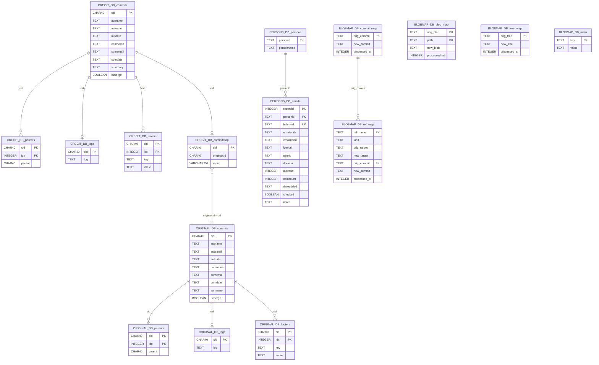
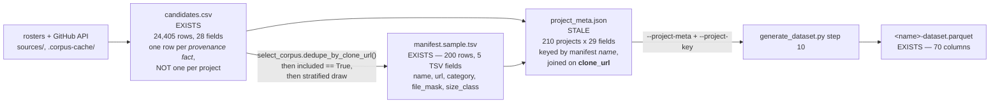
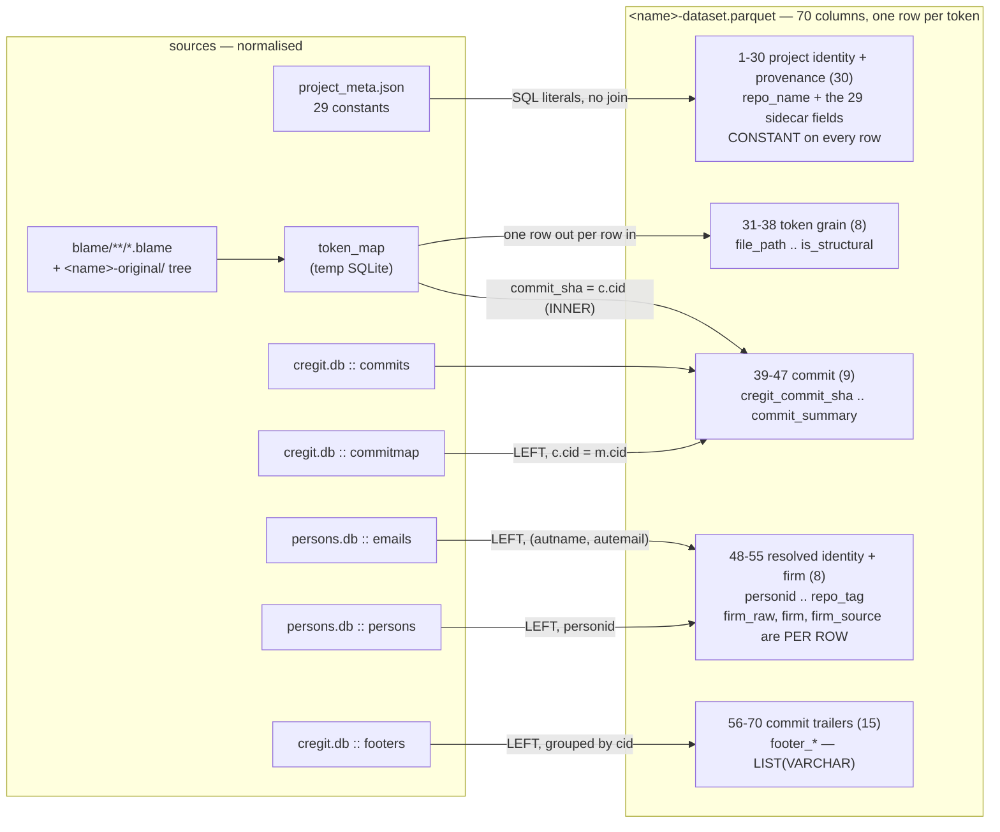
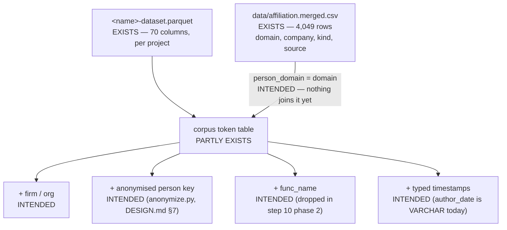

# The cregit dataset, in two views

Two pictures of the same data.

1. **The schema view** — the tables and columns as they actually exist on disk,
   one set per project, plus the two corpus-level files that key them.
2. **The joined (flat) view** — the single denormalised shape a researcher
   queries. Part of it exists today (the 70-column Parquet); part of it is only
   intended. Which is which is marked on every row.

> **Nothing here is copied from another document.** Every table name, column
> name and count below was read out of the code or measured against a real file
> on 2026-09-19. The commands are in [§7](#7-how-every-number-here-was-verified).
> Three documents in this project disagree with what is on disk; they are named
> in [§8](#8-documents-that-disagree-with-the-data).

Legend used throughout:

| Mark | Meaning |
| --- | --- |
| **EXISTS** | verified present in the code and in a real artefact today |
| **INTENDED** | the analytical shape a consumer wants; no code writes it yet |
| **STALE** | the artefact exists but its content is known out of date |

---

## 1. Schema view — what the pipeline actually builds

Per project, `run_pipeline_process.sh` produces four SQLite databases, two bare
git repositories, two working clones, a `blame/` tree, and one Parquet. Two
corpus-level files sit above all of them.

### 1.1 The artefacts, and which step writes each

| Artefact | Written by | Read by step 10? | Status |
| --- | --- | --- | --- |
| `<name>-original.git` (bare) | step 1 `git clone --bare` | no | EXISTS |
| `<name>-blobmap.db` | step 2 `blobExec` | no | EXISTS |
| `<name>-cregit.git` (bare) | step 2 `blobExec` | no | EXISTS |
| `<name>-original.db` | step 3 `slickGitLog` | **no** | EXISTS |
| `<name>-cregit.db` | step 4 `slickGitLog`, step 8 `remapCommits` | **yes** | EXISTS |
| `<name>-persons.db` / `-persons.xls` | step 5 `persons` (from the **original** bare repo) | **yes** (`.db`) | EXISTS |
| `<name>-original/`, `<name>-cregit/` (working clones) | step 6 | `-original/` yes, as the source text | EXISTS |
| `blame/**/*.blame` | step 7 `blameRepoFiles.pl` | **yes** | EXISTS |
| `html/` | step 9 (skipped with `--skip-html`) | no | EXISTS, disposable |
| `<name>-dataset.parquet` | step 10 `generate_dataset.py` | — | EXISTS |
| `sync_*.db` (`token_map`) | step 10, phase 1 | yes, then **deleted** | EXISTS transiently |

Note what step 10 does *not* read: `original.db` and `blobmap.db` contribute
nothing to the Parquet. `original.db` is kept for audits and re-derivation;
`blobmap.db` is the incremental-resume ledger.

### 1.2 Per-project SQLite schemas (real column names)



Counts, all measured (see [§7](#7-how-every-number-here-was-verified)):

| Database | Tables | Table names |
| --- | --- | --- |
| `<name>-original.db` | **4** | `commits`, `parents`, `logs`, `footers` |
| `<name>-cregit.db` | **5** | `commits`, `parents`, `logs`, `footers`, **`commitmap`** |
| `<name>-persons.db` | **2** | `persons`, `emails` |
| `<name>-blobmap.db` | **5** | `commit_map`, `blob_map`, `tree_map`, `ref_map`, `meta` |

Three name traps worth stating plainly, because all three are easy to get wrong:

* The cregit→original commit mapping table is **`commitmap`** in `cregit.db`.
  `commit_map` (with the underscore) is a *different* table, in `blobmap.db`,
  with different columns, and it maps original→cregit **commits produced by the
  rewrite**, not the tokenizer's provenance mapping.
* `persons.db :: persons` has **only two columns** (`personid`, `personname`).
  Every e-mail address, domain and counter lives in `emails`. So the Parquet's
  `person_email` and `person_domain` come from `emails`, not from `persons`.
* There is **no persisted `token_map` table**. It is created in a temporary
  `sync_*.db` beside the output, indexed, read once, and `unlink`ed at the end of
  step 10 (`generate_dataset.py:702`, `:905`). The token grain exists on disk
  only as `blame/**/*.blame` plus the `-original/` working tree, and after that
  only inside the Parquet.

### 1.3 The transient token table (step 10, phase 1)

```
token_map (SQLite, temporary — deleted when step 10 finishes)
  file_path      TEXT       relative path inside the repository
  token_index    INTEGER    0-based position in the file's blame stream
  commit_sha     CHAR(40)   the cregit commit that last touched this token
  token_type     TEXT
  token_value    TEXT
  source_text    TEXT
  source_line    INTEGER
  source_col     INTEGER
  is_structural  INTEGER
  func_name      TEXT       <-- computed, then NOT carried into the Parquet
```

`func_name` is the one column phase 1 computes and phase 2 drops. It is
populated only for `DECL` tokens. If a consumer needs function attribution it is
not in the published data today. INTENDED, not EXISTS.

### 1.4 The two corpus-level files



`candidates.csv` — **EXISTS.** 24,405 rows, 28 fields, 23,707 distinct
`clone_url`s. **It is not one row per project, and a diagram that drew it that
way would be wrong.** It keeps one row per *provenance fact*, so a repository
that two rosters name appears twice:

| Measured on `candidates.csv` | Value |
| --- | --- |
| rows | 24,405 |
| rows with an empty `clone_url` (never grouped) | 500 |
| distinct non-empty `clone_url`s | 23,707 |
| `clone_url`s carrying more than one row | **196** (194 pairs + 2 triples) |
| rows in those groups | 394 (198 surplus rows) |
| duplicate groups whose rows are byte-identical | **0** |
| duplicate groups disagreeing on `stratum` | 28 |
| **of the 200 corpus projects**, those with a duplicate group | **10** |
| of those 10, groups disagreeing on something | **10 (all of them)** |
| of those 10, groups disagreeing on `stratum` | **1 — `apache/doris`** |

The resolution rule is `select_corpus.dedupe_by_clone_url` (`select_corpus.py:1314`):
group by `clone_url`, and **the row whose owner matches the URL wins**. Anything
that reads `candidates.csv` must apply it, and `project_meta.py:70` does. What
the ten corpus duplicates disagree about:

| Project (`clone_url` basename) | Fields that disagree between its rows |
| --- | --- |
| `util-linux` | source, fact, owner |
| `Catch2` | source, fact, owner, repo, roster_name, roster_lang |
| `osquery` | source, fact, owner, roster_lang |
| `ZLMediaKit` | source, fact, owner, roster_lang, stars |
| `Lealone` | owner |
| `Mybatis-PageHelper` | source, fact, owner, roster_lang |
| `anki` | source, fact, owner, roster_lang |
| **`doris`** | source, **stratum**, fact, repo, roster_name, roster_lang, commits, size_kb, pushed_at |
| `incubator-seata` | source, owner, repo, roster_name |
| `rust-analyzer` | source, owner, roster_lang, stars, history_cluster, history_shared_with, history_relation, history_first, history_created |

`manifest.sample.tsv` — **EXISTS.** 200 rows, exactly five tab-separated fields.
Three parsers unpack those five positions and four tests assert them, which is
why the 29 provenance fields had to go in a sidecar instead.

`project_meta.json` — **STALE.** 210 projects (200 with
`provenance_status = 'candidates.csv'` + 10 development fixtures flagged
`fixture-needs-rework`), 29 fields each. It is stale on exactly one field:
`file_mask` still records the four old per-language masks
(62 `\.java$`, 59 `\.(c|cc|cp|cpp|cxx|h|hh|hpp)$`, 57 `\.[ch]$`, 32 `\.rs$`),
while all three manifests now carry one universal mask for every row. **It must
be regenerated before any Parquet is written**; another task owns that.

### 1.5 The join key is `clone_url`. It is never `name`.

`project_meta.py` keys its output by manifest *name* but **joins on
`clone_url`**, and that is not a stylistic choice.

`select_corpus.project_name(owner, repo)` (`select_corpus.py:79`) builds the name
as `slug(owner) + "__" + slug(repo)`, where `slug` lowercases and replaces every
run of characters outside `[a-z0-9-]` with a hyphen — so `_` and `.` both become
`-`. The transform is **not invertible**, and the owner recorded is the owner the
roster used, which may no longer own the repository. Measured over the 200 corpus
rows:

| | count |
| --- | ---: |
| names equal to `owner__repo` verbatim | 125 |
| names that need slugging to match the URL (case, `_`, `.`) | 60 |
| names that do **not** derive from the clone URL at all — renamed or transferred upstream | **15** |

Those 15, with the URL they actually point at:

```
erikd__libsndfile          -> libsndfile/libsndfile
freenet__fred              -> hyphanet/fred
akarnokd__rxjava2extensions-> akarnokd/RxJavaExtensions
biezhi__blade              -> lets-blade/blade
buchen__portfolio          -> portfolio-performance/portfolio
gitblit__gitblit           -> gitblit-org/gitblit
timmolter__xchange         -> knowm/XChange
datafuselabs__databend     -> databendlabs/databend
graknlabs__grakn           -> typedb/typedb
m-labs__smoltcp            -> smoltcp-rs/smoltcp
tomaka__glutin             -> rust-windowing/glutin
containers__composefs      -> composefs/composefs
apache__incubator-singa    -> apache/singa
wereturtle__ghostwriter    -> KDE/ghostwriter
datasketches__sketches-core-> apache/datasketches-java
```

So: `repo_name` is a **workdir and filename key** — it is what `ctp.py` locks and
stamps on, and it must stay filesystem-safe. `clone_url` is the **identity**.
Join on `clone_url`. Any analysis that joins the Parquet back to a roster on
`repo_name` silently loses at least those 15 projects.

---

## 2. Joined view — the flat Parquet that exists today

**EXISTS. 70 columns.** Authority: `EXPECTED_COLUMNS` in
`validate_schema.py:79-150`. Confirmed against a real file:
`qualcomm__qcom-embedded-power-measurement-dataset.parquet` → 70 columns,
180,971 rows, **0 drifts** from the contract.

It was 67 until 2026-09-20, when the three firm columns landed.

### 2.1 The collapse, in one picture



**The grain is one row per token occurrence per file**, at the blamed revision of
the cregit working clone — *not* one row per token per commit that touched it.
`git blame` attributes each token to exactly one commit, so `(file_path,
token_index)` is unique: 180,971 rows, 180,971 distinct pairs in the verified
file. There is no history of a token in the Parquet; there is one
last-touching commit per token.

### 2.2 The 70 columns, exactly

Block boundaries are 1-based and inclusive. `30 + 8 + 9 + 8 + 15 = 70`.

| # | Column | Type | Comes from | Note |
| ---: | --- | --- | --- | --- |
| 1 | `repo_name` | VARCHAR | `--repo-name` CLI | the manifest name, a lossy slug |
| 2 | `clone_url` | VARCHAR | sidecar | **the identity. Join on this.** |
| 3 | `provenance_status` | VARCHAR | sidecar | `candidates.csv` \| `fixture-needs-rework` |
| 4 | `source` | VARCHAR | sidecar | |
| 5 | `stratum` | VARCHAR | sidecar | |
| 6 | `fact` | VARCHAR | sidecar | |
| 7 | `contested` | VARCHAR | sidecar | |
| 8 | `label_date` | VARCHAR | sidecar | |
| 9 | `owner` | VARCHAR | sidecar | |
| 10 | `repo` | VARCHAR | sidecar | |
| 11 | `roster_name` | VARCHAR | sidecar | |
| 12 | `roster_lang` | VARCHAR | sidecar | |
| 13 | `language` | VARCHAR | sidecar | |
| 14 | `commits` | VARCHAR | sidecar | |
| 15 | `size_class` | VARCHAR | sidecar | |
| 16 | `size_kb` | VARCHAR | sidecar | |
| 17 | `stars` | VARCHAR | sidecar | |
| 18 | `pushed_at` | VARCHAR | sidecar | |
| 19 | `license` | VARCHAR | sidecar | |
| 20 | `owner_type` | VARCHAR | sidecar | |
| 21 | `archived` | VARCHAR | sidecar | |
| 22 | `fork` | VARCHAR | sidecar | |
| 23 | `history_cluster` | VARCHAR | sidecar | |
| 24 | `history_shared_with` | VARCHAR | sidecar | |
| 25 | `history_relation` | VARCHAR | sidecar | |
| 26 | `history_includes` | VARCHAR | sidecar | |
| 27 | `history_first` | VARCHAR | sidecar | |
| 28 | `history_created` | VARCHAR | sidecar | |
| 29 | `manifest_category` | VARCHAR | **manifest**, not the CSV | need not equal `stratum` |
| 30 | `file_mask` | VARCHAR | **manifest**, not the CSV | source is STALE in the sidecar |
| 31 | `file_path` | VARCHAR | blame path | |
| 32 | `token_index` | BIGINT | blame | 0-based, per file |
| 33 | `source_line` | BIGINT | source tree | 1-based |
| 34 | `source_col` | BIGINT | source tree | 1-based |
| 35 | `source_text` | VARCHAR | source tree | raw chars incl. trailing whitespace |
| 36 | `token_type` | VARCHAR | srcml2token | |
| 37 | `token_value` | VARCHAR | srcml2token | whitespace-stripped |
| 38 | `is_structural` | BIGINT | computed | 1 = boundary marker, 0 = real code |
| 39 | `cregit_commit_sha` | VARCHAR | blame | commit in the **cregit** repo |
| 40 | `original_commit_sha` | VARCHAR | `commitmap` | `coalesce(m.originalcid, t.commit_sha)` |
| 41 | `author_name` | VARCHAR | `cregit.db::commits.autname` | raw git string |
| 42 | `author_email` | VARCHAR | `commits.autemail` | |
| 43 | `author_date` | VARCHAR | `commits.autdate` | **string, not a timestamp** |
| 44 | `committer_name` | VARCHAR | `commits.comname` | |
| 45 | `committer_email` | VARCHAR | `commits.comemail` | |
| 46 | `committer_date` | VARCHAR | `commits.comdate` | **string, not a timestamp** |
| 47 | `commit_summary` | VARCHAR | `commits.summary` | first line only |
| 48 | `personid` | VARCHAR | `emails.personid` | LEFT join — may be NULL |
| 49 | `person_name` | VARCHAR | `coalesce(persons.personname, emails.personid)` | |
| 50 | `person_email` | VARCHAR | `emails.emailaddr` | |
| 51 | `person_domain` | VARCHAR | `emails.domain` | the key the firm join uses |
| 52 | `firm_raw` | VARCHAR | `affiliation.merged.csv.company` | the map's string, unaltered. `''` = domain not in the map |
| 53 | `firm` | VARCHAR | `firm_canonical.csv.firm` | the canonical name; equals `firm_raw` unless the reviewed table renames it |
| 54 | `firm_source` | VARCHAR | `affiliation.merged.csv.source` | the confidence tier. **`''` = no attribution**; `cncf-gitdm-single` = one person only |
| 55 | `repo_tag` | VARCHAR | `commitmap.repo` | `''` for a single-repo project |
| 56 | `footer_signed_off_by` | VARCHAR[] | `footers` | |
| 57 | `footer_co_authored_by` | VARCHAR[] | `footers` | |
| 58 | `footer_co_developed_by` | VARCHAR[] | `footers` | |
| 59 | `footer_reviewed_by` | VARCHAR[] | `footers` | |
| 60 | `footer_acked_by` | VARCHAR[] | `footers` | |
| 61 | `footer_tested_by` | VARCHAR[] | `footers` | |
| 62 | `footer_reported_by` | VARCHAR[] | `footers` | |
| 63 | `footer_suggested_by` | VARCHAR[] | `footers` | |
| 64 | `footer_based_on_patch_by` | VARCHAR[] | `footers` | |
| 65 | `footer_helped_by` | VARCHAR[] | `footers` | |
| 66 | `footer_mentored_by` | VARCHAR[] | `footers` | |
| 67 | `footer_assisted_by` | VARCHAR[] | `footers` | |
| 68 | `footer_thanks_to` | VARCHAR[] | `footers` | |
| 69 | `footer_personids` | VARCHAR[] | `footers` → `emails` | e-mail extracted from the trailer by regex |
| 70 | `footer_person_names` | VARCHAR[] | `footers` → `emails` → `persons` | |

Footer keys are matched case-insensitively (`LOWER(f.key) = 'signed-off-by'`) and
each list is ordered by `footers.idx`. `footer_personids` and
`footer_person_names` are `DISTINCT` and sorted, so they are a set, not aligned
with the 13 typed lists.

### 2.3 The actual join, as written

From `generate_dataset.py:712-747`, unedited in structure:

```sql
FROM token_map t
JOIN      commits c   ON t.commit_sha = c.cid          -- INNER: no commit, no row
LEFT JOIN commitmap m ON c.cid = m.cid
LEFT JOIN emails e    ON (c.autname = e.emailname AND c.autemail = e.emailaddr)
LEFT JOIN persons p   ON e.personid = p.personid
LEFT JOIN ( ... footers f LEFT JOIN emails fe ... GROUP BY f.cid ) ftr
                      ON c.cid = ftr.cid
ORDER BY t.file_path, t.token_index
```

Two consequences a consumer must plan for:

* `JOIN commits` is an **inner** join. A blamed commit missing from
  `cregit.db :: commits` drops its tokens silently. Nothing downstream reports it.
* `emails` is matched on the **pair** `(emailname, emailaddr)`, both exact. A
  commit whose author spelling differs from every `emails` row yields
  `personid = NULL`, and columns 48-51 are all NULL for that token. In the
  verified file the miss rate is 0 of 180,971 rows, but that project has only 2
  distinct persons; do not generalise it.

### 2.4 What one verified file looks like

`qualcomm__qcom-embedded-power-measurement`:

| | |
| --- | ---: |
| columns | 70 |
| rows | 180,971 |
| distinct `(file_path, token_index)` | 180,971 |
| distinct `file_path` | 298 |
| distinct `cregit_commit_sha` | 22 |
| distinct `personid` | 2 |
| rows with `personid IS NULL` | 0 |
| `is_structural = 0` (real code) | 158,766 |
| `is_structural = 1` (markers) | 22,205 |
| rows with a non-empty `footer_signed_off_by` | 0 |
| distinct `repo_tag` | 1 (`''`) |
| distinct metadata tuples | 1 — the 29 provenance columns are constant, by design |

---

## 3. Joined view — the shape a researcher wants (partly INTENDED)

The published Parquet is *almost* the analytical table. Four things are missing,
and none of them is written by any code today.



| Piece | Status | Evidence |
| --- | --- | --- |
| all 200 projects in one queryable table | **PARTLY EXISTS** | `consolidate.py` builds a DuckDB `tokens` view over `read_parquet([...])` — but it reads **`manifest.tsv`, hardcoded**, which holds 4 projects, and `ctp.py db` takes no `--manifest`. `read_parquet(['…/*-dataset.parquet'])` over the output directory works today without any code. |
| `firm` / employer per token | **EXISTS** since 2026-09-20 | Three columns, 52-54, joined per row from `data/affiliation.merged.csv` (4,049 rows) on `person_domain`, with `firm` canonicalised through the reviewed `data/firm_canonical.csv`. `generate_dataset.py --firm-map --firm-canonical`. **Only projects regenerated after that date carry it**; the rest hold three empty strings, which is what an empty `firm_source` means. |
| anonymised person key | **INTENDED** | `docs/DESIGN.md` §7.2 — `anonymize.py`, salted stable hash, salt kept local. Not written. |
| `func_name` | **INTENDED** | computed in step 10 phase 1, absent from the 70 columns. |
| dates as `TIMESTAMP` | **INTENDED** | `author_date`/`committer_date` are VARCHAR git strings. A consumer must cast. |
| `category` / `size_class` at corpus level | **REDUNDANT NOW** | `consolidate.py`'s view adds `p.category, p.size_class` from the manifest. Since the schema widened to 70, `manifest_category` (29) and `size_class` (15) are already in the Parquet, so the view's two extra columns duplicate them. |

The analytical table a consumer should write, on today's data:

```sql
-- EXISTS: works now, no new code. The glob resolves to 197 files today.
CREATE VIEW tokens AS
SELECT * FROM read_parquet('<out>/*/*-dataset.parquet')
WHERE provenance_status = 'candidates.csv';   -- drops the 10 dev fixtures

-- EXISTS since 2026-09-20: firm is IN the Parquet, so there is no join to write.
-- The `kind` column is the only part of the map the Parquet does not carry.
SELECT firm, COUNT(*) AS tokens
FROM tokens
WHERE is_structural = 0 AND firm <> ''
GROUP BY firm ORDER BY tokens DESC;
```

`provenance_status = 'candidates.csv'` is the one predicate that selects the
corpus. Without it a consumer mixes in the 10 development fixtures, whose 27
provenance columns are empty strings — and empty strings read as findings, not as
absences.

### 3.1 Why `firm_source` is a column and not a footnote — RESOLVED 2026-09-20

The first naive join against one real project produced **one firm for all 180,971
rows, and it was the wrong firm**:

```
firm   firm_kind   rows
CERN   company     180971
```

The project is `qualcomm__qcom-embedded-power-measurement`; both of its persons
write from `qti.qualcomm.com`; and `data/affiliation.merged.csv:2866` said

```
qti.qualcomm.com,CERN,company,cncf-gitdm-single
```

**Fixed.** That row now reads `qti.qualcomm.com,Qualcomm,company,correction`,
corrected in `data/affiliation.corrections.csv` — an overlay applied last by
`build_domain_map.py`, so a `build` keeps it, which a hand edit of the merged
file would not. The regenerated Parquet reads
`('qti.qualcomm.com', 'Qualcomm', 'Qualcomm', 'correction')` for all 180,971
rows. `tests/test_firm_attribution.py` is the named regression.

This was **not** a bug in `build_domain_map.py`. It is the risk that file's own
docstring names, and it had already materialised. `build_domain_map.py:399-407`
keeps single-person attestations deliberately — dropping them costs ~92% of the
yield — and marks them in `source` so a consumer can restrict to the corroborated
tier. That is why `firm_source` is column 54 rather than a footnote. The
distribution of the tier:

| `source` | rows | confidence |
| --- | ---: | --- |
| `cncf-gitdm-single` (+ `-self-reference`) | 2,771 + 28 = **2,799 of 4,049 (69%)** | **one person only** |
| `gitdm` (curated, hand-checked for the VEM paper) | 768 | high |
| `cncf-gitdm` (+ `-self-reference`) | 204 + 5 = 209 | ≥ `--min-persons` people agree |
| `spinellis-sec` (+ `-self-reference`) | 111 + 2 = 113 | published source |
| `patch` (curated) | 72 | high |
| `rich`, `builtin` | 55 + 33 | high / definitional |

Three more single-person rows that are plainly wrong on their face:
`central-intelligence.agency,Microsoft`, `intellisys.info,Takeaway.com` and
`collibra.com,Medidata` (Collibra is a different company). None is corrected:
the overlay holds one reviewed row, and a row-by-row audit of 2,771
single-person inferences is its own task.

The row filter stays available to a consumer, and now needs no join:

```sql
-- Restrict to the corroborated tier. firm_source is IN the Parquet.
SELECT firm, COUNT(*) FROM tokens
WHERE firm <> '' AND firm_source NOT LIKE 'cncf-gitdm-single%'
GROUP BY firm;
```

A `firm` column with no `firm_source` beside it is not publishable, which is why
all three landed together, exactly as `file_mask` carries the mask per row and
for the same reason.

### 3.2 Firm names were split, so firms were double-counted — RESOLVED 2026-09-20

The map holds 2,996 distinct `company` strings. `build_domain_map.norm_company`
strips legal suffixes but **does not case-fold**, and runs at parse time only, so
two sources could still disagree. Under a conservative key — case-fold, drop legal
and descriptive suffixes — **48 firms were counted as 100 separate entities**:
`NVIDIA`/`NVidia`, `Samsung`/`Samsung Electronics`, `Cisco`/`Cisco Systems`, and
worst, `IBM` (6 rows) against `International Business Machines` (44).

The fix is `data/firm_canonical.csv`: a **reviewed table, not a rule**. 52 rows
map a raw spelling to a canonical name, each with its reason; 11 more record a
candidate merge that was **rejected** — `AWS`→`Amazon` and `Azure`→`Microsoft`
(parent rollups, out of scope), `Samsung SDS`, `Yahoo! Japan`, `China Mobile
International` (separate companies), `Hewlett`/`HP` (HP Inc. and HPE split in
2015), `Independent`/`(Independent)` (one is 15 university domains, the other 58
free providers). An automatic rule would eventually merge two genuinely different
firms and nobody would notice; a table can be disagreed with one line at a time.

Note what an automatic rule would have got wrong here: the **all-caps spellings
come from the Spinellis SEC/Fortune source**, whose filing names are upper case,
and that is the *higher-confidence* source. A rule preferring the better source
would have canonicalised to `NETFLIX`, `TWITTER`, `ADOBE`.

`firm_raw` is never overwritten, so every merge is reversible by a reader.

---

## 4. Retention: what a consumer actually receives

A published dataset is **the Parquet files and nothing else.** Everything in
§1.1 above is intermediate, and most of it is deleted before publication.
`retain.py` is that policy, executable; `docs/DESIGN.md` §6 is the table it
implements.

Measured across the 198 project workdirs present on this machine today:

| Artefact class | Files | On-disk total | Published? |
| --- | ---: | ---: | --- |
| `*-dataset.parquet` | 197 | **5.81 GB** | **YES — this is the product** |
| `*-blobmap.db` | 198 | 10.12 GB | no — resume ledger |
| `*-cregit.db` | 198 | 6.08 GB | no |
| `*-original.db` | 198 | 5.32 GB | no |
| `*-persons.db` | 198 | 0.04 GB | no — and it holds raw e-mail addresses |
| `*-persons.xls` | 198 | 0.04 GB | no — same |
| `*-original.git`, `*-cregit.git` (bare) | 2 per project | — | no |
| `*-original/`, `*-cregit/` (working clones) | 2 per project | — | no, re-derivable |
| `blame/` | 1 per project | — | no, consumed by step 10 |
| `memo/` | 9 projects still have one | Linux: ~2.6 M entries | no, never |
| `html/` | `--skip-html` | 94-255 MB per project when written | no |

Parquet size distribution: median **4.8 MB**, mean excluding the largest
**22.9 MB**. Three projects dominate: `torvalds__linux` 1,452 MB,
`googleapis__google-cloud-java` 980 MB, `elastic__elasticsearch` 299 MB.
Without Linux the whole corpus is **4.39 GB**.

The intermediates are the expensive part. `torvalds__linux` alone holds
`original.db` 2.7 GB, `cregit.db` 2.5 GB, `blobmap.db` 2.0 GB, a 1.2 GB
`pipeline.log` and ~2.6 million memo entries — against a 1.5 GB Parquet. The
volume is at 1.1 TB used of 2.0 TB.

So, concretely, a consumer receives:

* **one Parquet per project**, 70 columns, ~5.8 GB for 197 projects as built;
* **not** the git repositories — a project is re-derivable from `clone_url` plus
  the recorded `file_mask`, which is exactly why `file_mask` is column 30;
* **not** `persons.db` or `persons.xls`. Those carry raw e-mail addresses.
  `person_email` is in the Parquet today, so **publishing the Parquet as-is
  publishes e-mail addresses.** `DESIGN.md` §7.2's `anonymize.py` is the answer,
  and it is INTENDED, not written. Treat this as a release blocker, not a detail.

---

## 5. Reading the two views side by side

| | Schema view (§1) | Joined view (§2) |
| --- | --- | --- |
| Files per project | 4 SQLite DBs, 2 bare repos, 2 clones, `blame/` | 1 Parquet |
| Tables | 4 + 5 + 2 + 5 = **16** | **1** |
| Grain | commit (`commits`), person (`persons`), blob (`blob_map`), token (`blame` lines) | **one row per token per file** |
| Identity | `cid` inside a project; `clone_url` across projects | `clone_url` (col 2); `repo_name` (col 1) is a slug |
| Per-project constants | stored once, in `project_meta.json` | repeated on **every row** (cols 1-30) |
| Cost | ~22 GB of SQLite + repos + clones | 5.81 GB of Parquet |
| Published | no | yes |

The repetition in columns 1-30 is deliberate, and `validate_schema.py:44` gives
the reason: a reader can filter a corpus without a second join, and a column is
cheap to drop at publish time but expensive to add later.

---

## 6. Invariants a future change must not break

| Invariant | Enforced by |
| --- | --- |
| every Parquet has the same 70 columns, same types, same order | `validate_schema.py` (exit 1 on any drift) |
| the 29 provenance names agree across three files in two repos | `tests/test_meta_field_drift.py` — checks `project_meta.META_FIELDS`, `validate_schema.EXPECTED_COLUMNS[1:30]`, `generate_dataset.PROJECT_META_FIELDS` |
| the mask names only extensions with a working parser | `tests/test_mask_drift.py` vs `tokenize/CregitLanguages.pm` |
| a missing sidecar key fails loudly, never blanks 29 columns | `generate_dataset.load_project_meta` raises `SystemExit` |
| duplicate `clone_url`s resolve the same way everywhere | `select_corpus.dedupe_by_clone_url`, called by `project_meta.build_meta` |

---

## 7. How every number here was verified

Run from `/local/home/ellianco/Projects/cregit-token-pipeline` unless stated.

**The 70-column contract, and that it equals the 29 metadata fields in order:**

```bash
python3 -c "
from validate_schema import EXPECTED_COLUMNS as E
from project_meta import META_FIELDS as M
names=[n for n,_ in E]
print(len(E), len(M), names[1:30]==list(M), names.index('file_path'))
for i,n in enumerate(names): print(i+1, n, dict(E)[n])
"
# -> 70 29 True 30
```

**The live Parquet** (`devenv shell` from `.../cregit-workspace/cregit-issue61`,
because `duckdb` comes from devenv):

```bash
devenv shell --quiet -- python3 -c "
import duckdb, sys
p='/local/home/ellianco/Projects/cregit-workspace/corpus-files/qualcomm__qcom-embedded-power-measurement/qualcomm__qcom-embedded-power-measurement-dataset.parquet'
rows=duckdb.sql('describe select * from read_parquet(?)',params=[p]).fetchall()
print(len(rows), duckdb.sql('select count(*) from read_parquet(?)',params=[p]).fetchone())
sys.path.insert(0,'/local/home/ellianco/Projects/cregit-token-pipeline')
from validate_schema import compare_schema
print(compare_schema([(r[0],r[1]) for r in rows]))
"
# -> 70 (180971,) []
```

**The SQLite schemas** (`sqlite3` is not on `PATH`; read through python, read-only):

```bash
python3 -c "
import sqlite3
base='/local/home/ellianco/Projects/cregit-workspace/corpus-files/torvalds__linux/torvalds__linux'
for kind in ('original','cregit','blobmap','persons'):
    c=sqlite3.connect(f'file:{base}-{kind}.db?mode=ro&immutable=1',uri=True)
    print(kind, [r[0] for r in c.execute(
        \"select name from sqlite_master where type='table' order by name\")])
"
# original: commits, footers, logs, parents
# cregit:   commitmap, commits, footers, logs, parents
# blobmap:  blob_map, commit_map, meta, ref_map, tree_map
# persons:  emails, persons
```

**`candidates.csv` duplicates, and which corpus projects they hit:**

```bash
python3 -c "
import csv, collections, pathlib
rows=list(csv.DictReader(open('candidates.csv',newline='')))
g=collections.defaultdict(list)
for r in rows:
    if r['clone_url']: g[r['clone_url']].append(r)
dup={u:v for u,v in g.items() if len(v)>1}
print(len(rows), len(g), len(dup), collections.Counter(map(len,dup.values())))
print('identical groups', sum(1 for v in dup.values()
      if all(tuple(r.values())==tuple(v[0].values()) for r in v)))
man=[l.split(chr(9)) for l in pathlib.Path('manifest.sample.tsv').read_text().splitlines()
     if l.strip() and not l.startswith('#')]
hit=[f[1] for f in man if f[1] in dup]
print('corpus hits', len(hit),
      'stratum disagreements', sum(1 for u in hit if len({r['stratum'] for r in g[u]})>1))
"
# -> 24405 23707 196 Counter({2: 194, 3: 2}) ; identical groups 0
# -> corpus hits 10 ; stratum disagreements 1
```

**Names that do not round-trip from the clone URL:**

```bash
python3 -c "
import pathlib, select_corpus as sc
n=v=b=0
for l in pathlib.Path('manifest.sample.tsv').read_text().splitlines():
    if not l.strip() or l.startswith('#'): continue
    name,url,*_=l.split(chr(9))
    o,r=url.rstrip('/').removesuffix('.git').split('/')[-2:]
    if sc.project_name(o,r)!=name: b+=1
    elif f'{o}__{r}'!=name: v+=1
    else: n+=1
print('verbatim',n,'slug-only',v,'renamed/transferred',b)
"
# -> verbatim 125 slug-only 60 renamed/transferred 15
```

**Sidecar staleness, and manifest masks:**

```bash
python3 -c "
import json, collections, pathlib
m=json.load(open('project_meta.json'))
print(len(m), len(next(iter(m.values()))))
print(collections.Counter(v['file_mask'] for v in m.values()))
print(collections.Counter(v['provenance_status'] for v in m.values()))
for f in ('manifest.sample.tsv','manifest.phase1-sm.tsv','manifest.generated.tsv'):
    L=[l.split(chr(9)) for l in pathlib.Path(f).read_text().splitlines()
       if l.strip() and not l.startswith('#')]
    print(f, len(L), collections.Counter(x[3] for x in L))
"
# -> 210 projects, 29 fields; 4 distinct file_mask values (STALE);
#    200 candidates.csv + 10 fixture-needs-rework;
#    all three manifests: one universal mask on every row
```

**The firm join, and the CERN result in §3.1** (devenv, from `cregit-issue61`):

```bash
devenv shell --quiet -- python3 -c "
import duckdb
d='/local/home/ellianco/Projects/cregit-workspace/corpus-files'
p=f'{d}/qualcomm__qcom-embedded-power-measurement/*-dataset.parquet'
duckdb.sql(f\"create view tokens as select * from read_parquet('{p}') \"
           \"where provenance_status='candidates.csv'\")
duckdb.sql(\"create view twf as select t.*, coalesce(a.company,'(Unknown)') as firm, \"
  \"a.kind as firm_kind from tokens t left join \"
  \"read_csv('/local/home/ellianco/Projects/cregit-token-pipeline/data/\"
  \"affiliation.merged.csv') a on lower(t.person_domain)=lower(a.domain)\")
print(duckdb.sql('select firm, firm_kind, count(*) from twf group by 1,2').fetchall())
print('cols', len(duckdb.sql('describe select * from twf').fetchall()))
print('glob', duckdb.sql(f\"select count(*) from glob('{d}/*/*-dataset.parquet')\").fetchone())
"
# -> [('CERN', 'company', 180971)]   cols 69   glob (197,)

python3 -c "
import csv, collections
rows=list(csv.DictReader(open('data/affiliation.merged.csv')))
print(len(rows), collections.Counter(r['source'] for r in rows))
"
# -> 4049 ; cncf-gitdm-single 2771, gitdm 768, cncf-gitdm 204, spinellis-sec 111,
#    patch 72, rich 55, builtin 33, correction 1, *-self-reference 35
# `correction` is data/affiliation.corrections.csv, this repository's reviewed
# overlay, applied last by build_domain_map so a rebuild keeps it.
```

**Artefact sizes** (from `.../cregit-workspace/corpus-files`):

```bash
python3 -c "
import os, glob
k={}
for p in glob.glob('*/*'):
    for s in ('-original.db','-cregit.db','-blobmap.db','-persons.db',
              '-persons.xls','-dataset.parquet'):
        if os.path.basename(p).endswith(s):
            a,c=k.get(s,(0,0)); k[s]=(a+os.path.getsize(p), c+1)
for s,(a,c) in sorted(k.items()): print(f'{s:20} {c:4} {a/2**30:7.2f} GB')
"
```

**Suite, before and after this document:** `./run_tests.sh` →
`1033 passed, 4 xfailed, 1 xpassed`.

---

## 8. Documents that disagree with the data

Recorded here so the next reader does not re-derive them.

| Document | What it says | What is true |
| --- | --- | --- |
| `ellians-master/2026.2-estudos-pesquisa-sistemas/PHASE-1-CORPUS-REPORT.md` §4 | 37 columns, and *"Today those [`history_*`] columns live only in `candidates.csv` and `manifest.sample.tsv` … not joined into the token-level Parquet"* | **70 columns.** The six `history_*` columns are columns 23-28 of the Parquet and have been since `b1e83d8`. |
| `cregit-issue61/generate_dataset/DATASET.md` | documented 9 token + 29 provenance + 9 commit + 5 identity = **52** columns | 70. The 3 firm columns were added to it on 2026-09-20; the **15 `footer_*` columns are still documented nowhere in it**. |
| `project_meta.json` | four per-language `file_mask` values | one universal mask since `57458cb`. Regeneration is owned by another task. |
| `select_corpus.py:1325` docstring | *"Five pairs also disagree on the stratum"* | 28 duplicate groups disagree on `stratum` across the whole file. The claim is presumably scoped to the eligible subset; it reads as a whole-file claim and is easy to misread. Left unchanged — code was out of scope for this document. |
| `consolidate.py` | builds the corpus-wide `tokens` view | it reads **`manifest.tsv`, hardcoded** (4 projects), and `ctp.py db` accepts no `--manifest`. The corpus-level view over all 200 does not exist yet. |
| `README.md` | *"~101 projects"* | the drawn sample is 200; 197 Parquets exist on disk. |

---

*Written 2026-09-19 against pipeline `57458cb` and CREGIT `4dbc556`. If you change
`EXPECTED_COLUMNS`, change §2.2 in the same commit — `validate_schema.py` is the
contract, this file is only its picture.*
