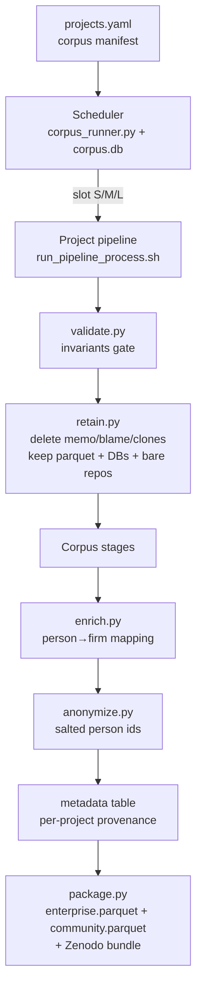

# Corpus Execution Pipeline — Design

**Goal:** run cregit end-to-end over ~101 large FLOSS projects (50 enterprise-backed,
50 community-backed, 1 Linux) and produce two published datasets with a shared schema,
for the MSR 2027 Data & Tool Track (paper deadline 10 Nov 2026).

**Milestone alignment (PLAN.md):** design 28 Aug ✓ · pipeline build 4 Sep · corpus runs
11 Sep – 2 Oct · paper from 2 Oct.

**Hardware assumption:** single dev-desk — 16 cores, 30 GB RAM, ~1.2 TB free on one NVMe.

---

## 1. What already exists (reuse, don't rebuild)

| Asset | Role | Status |
| --- | --- | --- |
| `cregit/run_pipeline_process.sh` | Parameterized 11-step per-project pipeline (`--repo-url/--repo-name/--work-dir/--file-filter`), incremental + resumable | Working (kernel-proven) |
| blobExec incremental engine | src.git → dst.git with `blobmap.db` frontier; resume-safe; parallel pipeline (PR #56 work) | Working |
| `tokenize/tokenize.pl` dispatcher | Fans out by language (srcML for C/H, rustTokenizer for .rs, ctags, …) | Working |
| `generate_dataset.py` | blame + DBs → per-project Parquet | Working |
| `run_kernel_cregit.sh` | flock single-instance guard + log + resume launcher pattern | Template for the runner |

The corpus pipeline is therefore an **orchestrator around the existing per-project
pipeline**, plus new corpus-level stages (enrich, anonymize, merge, package). We do not
touch cregit internals except two small flags (§4).

## 2. Architecture overview



Two layers:

1. **Per-project layer** — existing `run_pipeline_process.sh`, one workdir per project,
   embarrassingly parallel across projects.
2. **Corpus layer** — new scripts that only read finished per-project artifacts.
   Deterministic, cheap, re-runnable any time.

## 3. Corpus manifest (`projects.yaml`)

One entry per project; the manifest is the single source of truth and is itself a
published dataset artifact (provenance for the paper).

```yaml
- name: kubernetes
  url: https://github.com/kubernetes/kubernetes.git
  category: enterprise          # enterprise | community | kernel
  file_filter: '\.go$'          # per-project, from supported-language matrix
  pinned_commit: null           # filled by acquire stage at clone time — REPRODUCIBILITY PIN
  size_class: null              # filled after clone: S | M | L (by commit count)
  notes: ""
```

Rules:

- `pinned_commit` is stamped at first clone and never changes; every later resume/re-run
  analyzes exactly that commit. The published dataset cites URL + sha.
- `file_filter` comes from a supported-language matrix (language → tokenizer → regex).
  Projects whose dominant language has no tokenizer are excluded at selection time.
- Selection heuristics (stars/size/language thresholds) are a **separate concern** —
  a `select_corpus.py` that emits candidate rows for manual curation. The runner only
  consumes the curated manifest.

## 4. Per-project pipeline (delta vs today)

Stages 1–11 stay as-is. Two small additions to `run_pipeline_process.sh`:

- `--skip-html` — step 10 (prettyPrint HTML views) is browsing output, not needed for
  the dataset. Saves hours and GBs per project. Blame (step 8) **cannot** be skipped —
  `generate_dataset.py` consumes `--blame-dir`.
- `--no-memo` (or `BFG_MEMO_DIR=` empty → tmpfs) — kernel evidence: 301 GB of memos
  bought ~80 ms/moved-blob. At 100 projects the memo dirs are the #1 disk risk for
  near-zero value. Default OFF for corpus runs; `blobmap.db` (level-1 cache) remains and
  is what makes resume cheap.

Plus one new post-step, outside cregit:

- **validate** — hard gate before a project is marked DONE:
  parquet exists and is non-trivial; token rows > 0; `persons.db` rows > 0;
  commit count in `-original.db` == `git rev-list --count pinned_commit`;
  schema columns match the corpus schema version.

## 5. Orchestrator (`corpus_runner.py`)

Plain Python + SQLite (`corpus.db`), following your deterministic-scripts preference.
No Airflow/Snakemake dependency — the DAG is trivial (linear per project, fan-in at
corpus layer); the hard part is state + resource scheduling, which is ~300 lines.

**State model** (`corpus.db`):

```
projects(name, url, category, pinned_commit, size_class, state, workdir, updated_at)
stage_runs(project, stage, attempt, rc, started_at, finished_at, log_path)
```

`state ∈ {QUEUED, CLONING, RUNNING, VALIDATING, COMPACTING, DONE, FAILED, QUARANTINED}`

- Idempotent tick loop: each invocation scans states, launches work up to slot limits,
  records transitions. Safe to kill and re-run at any point (per-project resume is
  delegated to blobExec's own incremental frontier + `from-step`).
- **flock per project** (kernel launcher pattern) so a cron tick never double-starts.
- FAILED → auto-retry once (resume mode); second failure → QUARANTINED for manual
  triage; the corpus run never blocks on one bad project.

**Resource scheduling — size classes, not a global N:**

| Class | Heuristic (commits) | Concurrent slots | blobExec threads | JVM heap |
| --- | --- | --- | --- | --- |
| S | < 30k | up to 4 | 2 | 2 GB |
| M | 30k–150k | up to 2 | 4 | 4 GB |
| L | > 150k | 1 (exclusive-ish) | 8 | 8 GB |

Mix rule: total weight ≤ 16 cores and ≤ ~22 GB heap (leave headroom for perl/python
stages). One L + two M, or one L + four S, etc. RAM (30 GB) is the binding constraint,
not cores.

**Disk guard:** before launching any project, require free space >
`3 × bare-repo size + 50 GB` floor; below 150 GB free, launch nothing new and only
finish in-flight work. Compaction (§6) runs eagerly, right after validate.

**Path canonicalization:** the runner resolves every path through
`realpath` → `/local/home/...` form before invoking blobExec. This is load-bearing:
blobExec's meta table refuses resume when the command string differs, and
`/home` vs `/local/home` aliasing has already caused a refusal once.

## 6. Disk lifecycle & retention

Kernel evidence: essentials ≈ 11.7 GB (bare original + dst.git + blobmap.db); memos were
301 GB of dead weight. Per-project retention after DONE:

| Artifact | Keep? | Why |
| --- | --- | --- |
| `<name>-dataset.parquet` | ✅ forever | The product |
| `<name>-original.db`, `-cregit.db`, `-persons.db` | ✅ forever | Cheap, needed for enrich/anonymize + audits |
| `<name>-original.git` (bare) | ✅ until publication | Re-derivation + review responses |
| `<name>-cregit.git` (dst) | ✅ until publication | Incremental re-runs if tokenizer fix lands |
| `blobmap.db` | ✅ until publication | Resume/re-run cheaply |
| memo/ | ❌ delete (ideally never written) | Proven negligible value |
| working clones (non-bare) | ❌ delete after parquet | Re-derivable from bare |
| blame/ dir | ❌ delete after parquet | Consumed by generate_dataset; re-derivable |
| html/ | ❌ never generated (`--skip-html`) | Not a dataset artifact |

Budget check: 100 projects × (typical 0.5–5 GB essentials) + kernel 11.7 GB ≈
**150–400 GB retained** — comfortably inside 1.2 TB *only if* compaction is eager and
memos are off. Without those two policies the run dies on disk mid-corpus.

## 7. Corpus-level stages (new code)

All pure functions over finished per-project artifacts; each re-runnable in minutes.

1. **enrich.py** — person → firm mapping across the employer-employee fold: email-domain
   table + manual overrides (same approach as the kernel corporate-TF work). Output:
   `firms.parquet` join table. The domain→firm mapping table is itself curated + versioned.
2. **anonymize.py** — weak anonymization for publication: salted stable hash of person id;
   private salt + reverse mapping kept local, never published. Firm names stay (public data).
3. **metadata table** — one row per project: name, category, url, pinned sha, commit
   count, token rows, file count, language(s), run duration, cregit version, tokenizer
   versions. This is the Data-track "dataset card" backbone.
4. **package.py** — emits `enterprise/` and `community/` dataset trees with the **same
   schema** (+ kernel as its own labeled member), a `SCHEMA.md`, the manifest, the
   metadata table, and checksums; bundles for Zenodo/figshare upload.

**Provenance pinning (MSR reviewers care):** every per-project run writes a
`provenance.json` — cregit git sha, blobExec jar sha256, srcml/ctags versions, file
filter, pinned commit, wall time. Aggregated into the metadata table.

## 8. Observability

- Per-project logs under `<workdir>/pipeline.log` (already exists) + runner log.
- `status.py` — one-screen table from `corpus.db`: DONE/RUNNING/QUEUED/QUARANTINED
  counts, ETA from median stage durations, disk free. A MeshClaw cron can post the
  digest daily during the 11 Sep–2 Oct window.
- QUARANTINED projects listed with last 30 log lines for fast triage.

## 9. Throughput sanity check

Assume medians: S ≈ 20 min, M ≈ 2 h, L ≈ 12 h wall (blobExec parallel; kernel as the
known worst case already done separately). With the slot mix running 24/7:

- ~50 S + ~35 M + ~15 L ≈ 17 h + 35 h + 180 h of L-serial time ≈ **10–12 days** wall.
- Fits the 3-week window with ~40% slack for quarantine triage and re-runs. The kernel
  does not need re-running (existing artifacts are reused as-is).

Biggest schedule risk is a handful of mega-projects (LLVM/gcc-scale). Mitigation:
size cap at selection time, and the L class is measured after clone — anything that
projects > 36 h gets flagged before burning the slot.

## 10. Failure modes considered

| Failure | Handling |
| --- | --- |
| Crash mid-blobExec | blobmap frontier resume; runner relaunches with same canonical command |
| Disk full | Disk guard halts launches; eager compaction; memos off by default |
| One project poisons the run | QUARANTINED state; corpus continues |
| Tokenizer bug found mid-corpus | dst.git + blobmap retained → incremental re-tokenize only affected blobs; parquet regenerate |
| Meta mismatch refusal | Canonical `/local/home` realpath enforced at the runner boundary |
| Dev-desk reboot | Idempotent tick loop + flock; cron restarts the runner |

## 11. Build plan (target: runnable by 4 Sep)

1. `--skip-html` + `--no-memo` flags in `run_pipeline_process.sh` (small, test on jq).
2. `corpus_runner.py` + `corpus.db` schema + flock/tick loop; smoke on 2 S projects.
3. `validate.py` + `retain.py`; wire as post-stages.
4. `select_corpus.py` heuristics → candidate list → manual curation → `projects.yaml`.
5. `status.py` + daily digest cron.
6. Corpus-level: `enrich.py`, `anonymize.py`, metadata, `package.py` (can land during
   the run window — they only need finished projects).

MVP-first: steps 1–3 validated on jq + one M-class project end-to-end before any batch.
